# PARU // Arquitetura Sonora — Plano Mestre do Website

> **Status do Documento**: Proposta Estratégica & Arquitetural  
> **Artista**: Paulo Victor (PARU) — DJ & Produtor Musical  
> **Gênero**: Indie Dance & Minimal Deep Tech  
> **Data**: Setembro de 2026  

---

## 1. Visão Geral & Propósito

O objetivo deste projeto é criar uma plataforma digital de presença global para o DJ e produtor **PARU**, posicionando-o como uma referência de autoridade, precisão técnica e vanguarda musical.

O conceito do site traduz o manifesto do artista:  
**"A máquina dita o pulso, a pista define a frequência. O próximo show está configurado. Vejo vocês no centro do som."**

Para alcançar uma experiência impactante e de alta conversão, unificamos:
1. **O Brandbook Oficial de PARU**: O arquétipo do *Arquiteto de Sistemas Sonoros*, paleta Cyberpunk Dark Mode (`#1A1A1A`, `#12FE07`, `#FF2E88`), tipografia técnica e o **Mascote Felino em Geometria Brutalista**.
2. **A Infraestrutura e Autoridade de Martin Garrix** ([martingarrix.com](https://martingarrix.com/)): Stack Next.js moderna, hero cinematográfico e catálogo de lançamentos profissional integrado com plataformas de streaming.
3. **A Conversão e Funcionalidade de James Hype** ([jameshype.com](https://jameshype.com/)): Fluxo de agenda de shows sem atrito, botão de compra de ingressos em 1 clique e canal direto para contratantes/bookers.
4. **O Magnetismo e Animação de Peggy Gou** ([peggygou.com](https://www.peggygou.com/)): Identidade marcante com avatar/mascote animado, micro-interações sonoras e estética lúdica/hipnótica.

---

## 2. Diagnóstico da Identidade Visual (Brandbook PARU)

Analisamos detalhadamente a apresentação oficial de diretrizes de marca (`PARU Brand Guideline Presentation.pdf`):

| Atributo | Diretriz Oficial | Aplicação no Website |
| :--- | :--- | :--- |
| **Arquétipo** | O Criador / Arquiteto | Postura de mistério e autoridade técnica. O site é concebido como um "sistema operacional sonoro" (*PARU CORE v2.0*). |
| **Paleta de Cores** | Grafite `#1A1A1A`, Verde Terminal `#12FE07`, Rosa Neon `#FF2E88`, Branco `#F9F9F9`, Preto `#000000` | Fundo dark absoluto com iluminação lateral rosa neon (rim light), cartões em grafite chassi e elementos interativos em verde terminal. |
| **Tipografia** | **Codec Pro** (Títulos/Logo), **Fira Code** (Terminal/Metadados), **Inter** (Textos longos) | Hierarquia clara: títulos pesados e dinâmicos em itálico, status de terminal monoespaçados e leitura confortável no corpo de texto. |
| **Mascote Oficial** | Felino em Geometria Brutalista | Transformado em elemento interativo vivo no site (olhos neon piscando, pulso sonoro a 128 BPM e reatividade ao cursor). |
| **Linguagem & Tom** | Confiante, moderna, autêntica, direta ao ponto | Comandos de terminal, indicadores de BPM e métricas técnicas sem rodeios. |

### Registros Visuais do Brandbook
| Capa & Logo 3D Glow | Brand Voice & Terminal |
| :---: | :---: |
| 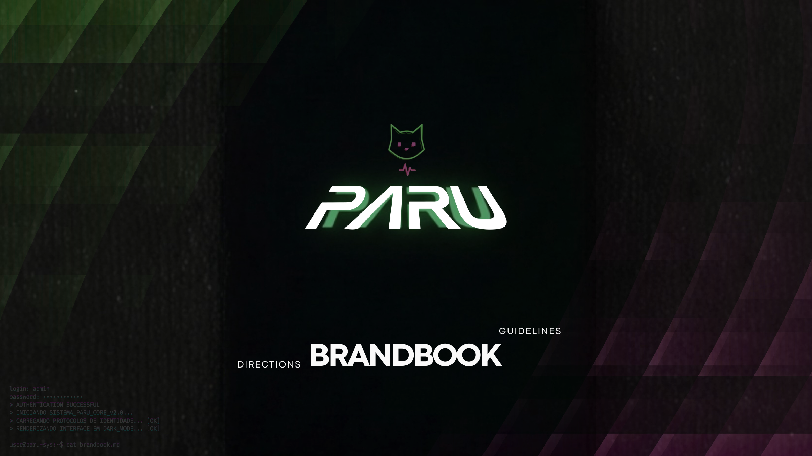 | 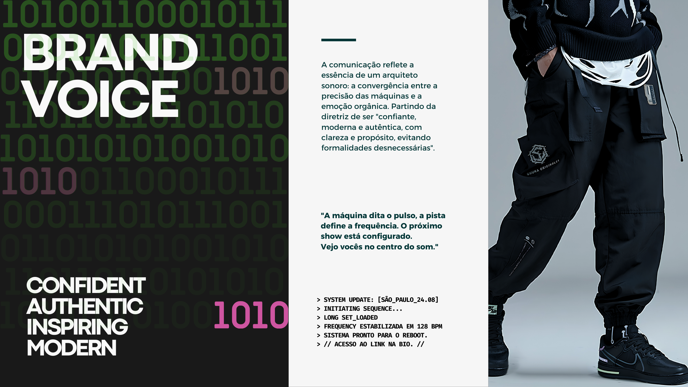 |
| **Moodboard (Máquinas & Rave)** | **Mascote: Felino Brutalista** |
| 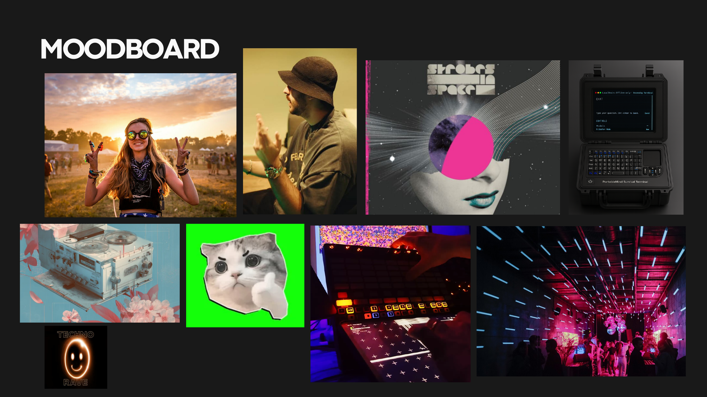 | 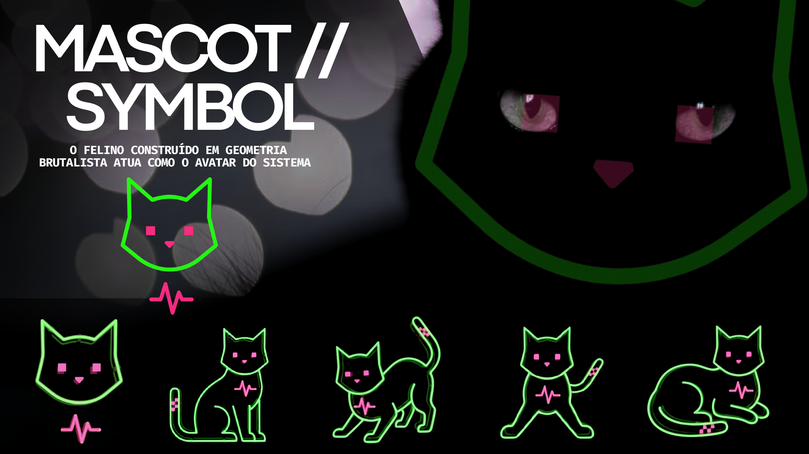 |
| **Tipografia Oficial** | **Paleta de Cores & Gradientes** |
| 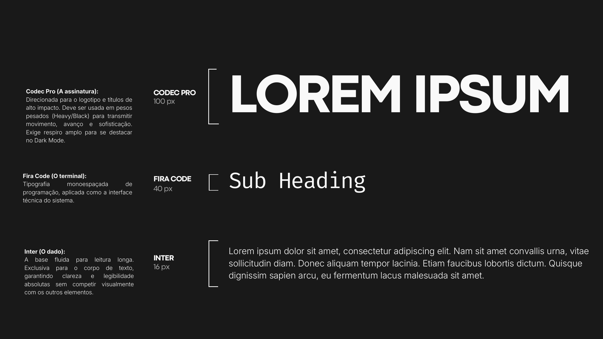 | 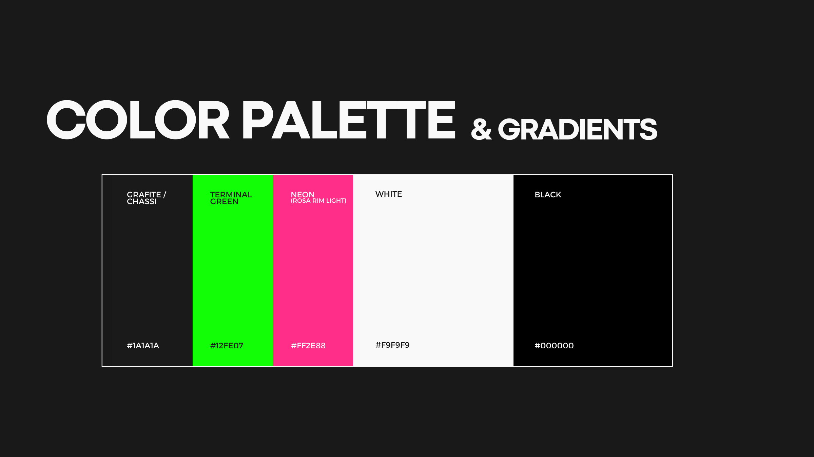 |

---

## 3. Benchmarking das Referências

Navegamos e capturamos registros de cada uma das três referências apontadas:

### 3.1. Referência 1: Martin Garrix (Next.js)
- **URL**: [martingarrix.com](https://martingarrix.com/)
- **O que faz com maestria**:
  - Hero imersivo com tipografia marcante e vídeo de fundo com transição suave.
  - Grade completa de lançamentos com arte do álbum, data e links para Spotify, Apple Music, Beatport e YouTube.
  - Carregamento instantâneo via Next.js com zero atraso perceptível de navegação.
- **Como adaptamos para PARU**: Criaremos uma central de lançamentos com o mesmo rigor profissional e metadados musicais (BPM, tonalidade, gravadora).

| Martin Garrix Hero | Martin Garrix Releases |
| :---: | :---: |
| 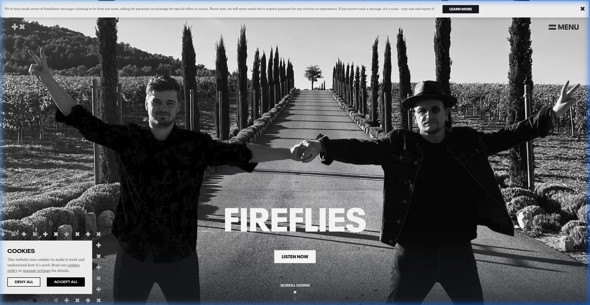 | 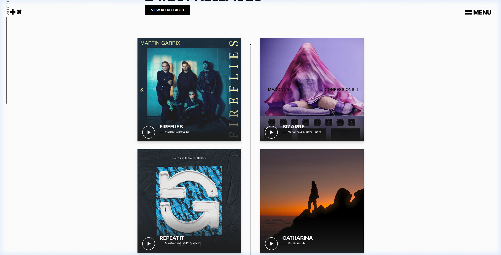 |

---

### 3.2. Referência 2: James Hype (Wix - Simples & Funcional)
- **URL**: [jameshype.com](https://jameshype.com/)
- **O que faz com maestria**:
  - Clareza radical: o usuário que entra no site encontra a agenda de shows imediatamente.
  - Cada data possui link direto para compra de ingressos ou inscrição em lista de espera.
  - Informações de contato e agenciamento (UK, Americas, Rest of World) extremamente fáceis de localizar para promotores de eventos.
- **Como adaptamos para PARU**: A seção de agenda de shows de PARU será direta, limpa e de alto contraste, com botões para compra de ingressos e um botão de ação imediata: **"Contratar PARU para seu evento"**.

| James Hype Hero | James Hype Tour Dates | James Hype Bookings |
| :---: | :---: | :---: |
| 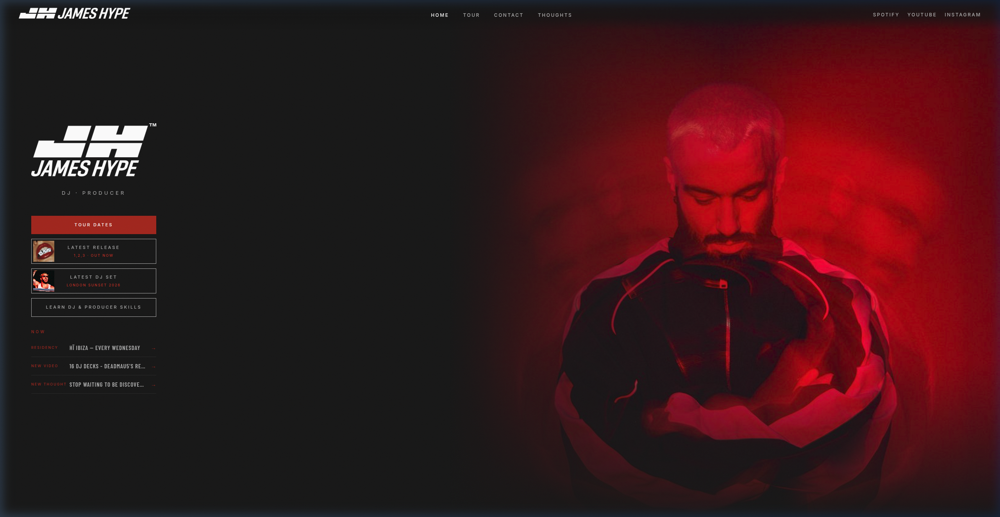 | 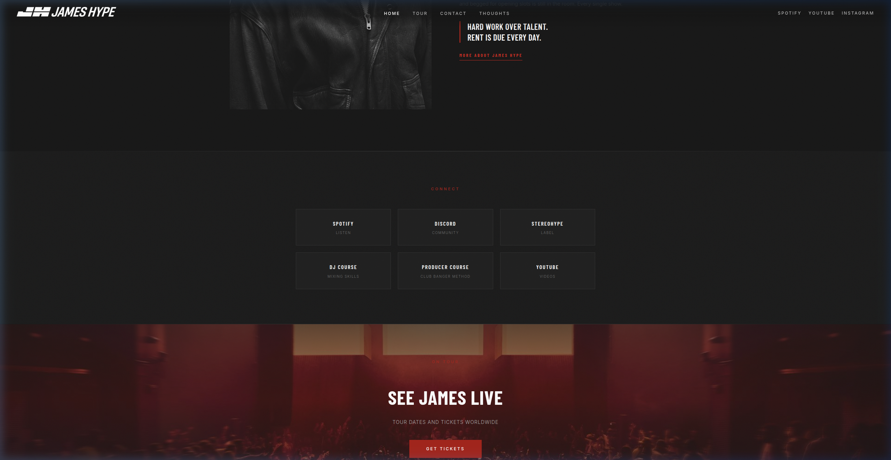 | 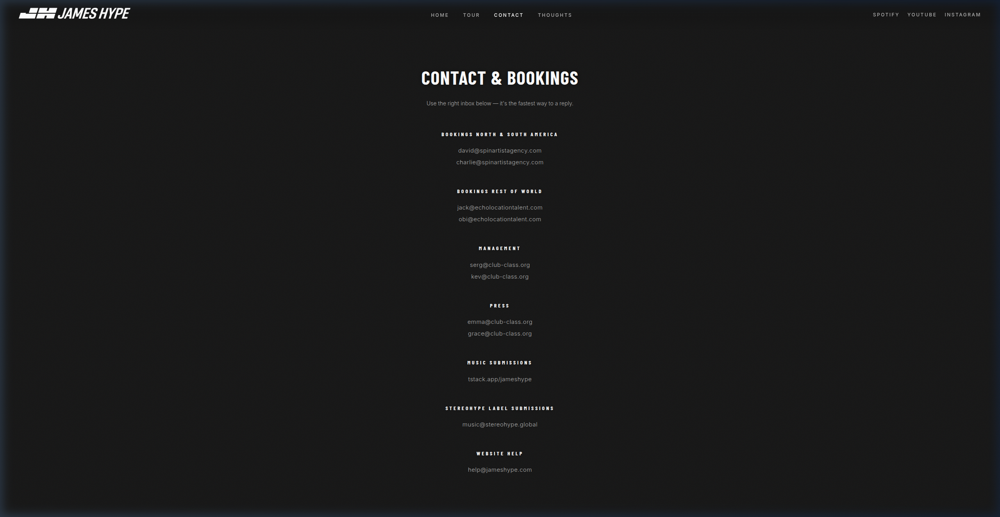 |

---

### 3.3. Referência 3: Peggy Gou (Animação Memorável & Avatar)
- **URL**: [peggygou.com](https://peggygou.com/)
- **O que faz com maestria**:
  - Personificação da marca através de um avatar carismático e marcante que passeia e interage pela interface.
  - Navegação experimental com física suave, badges dinâmicos e micro-animações.
  - Gera memorabilidade instantânea: o visitante nunca confunde o site da Peggy Gou com nenhum outro DJ de música eletrônica.
- **Como adaptamos para PARU**: O **Felino Geométrico Brutalista** de PARU (página 11 do brandbook) será o protagonista interativo, pulsando na frequência de **128 BPM** e reagindo ao movimento do mouse e aos cliques do visitante.

| Peggy Gou Landing & Avatar | Peggy Gou Interactive Music |
| :---: | :---: |
| 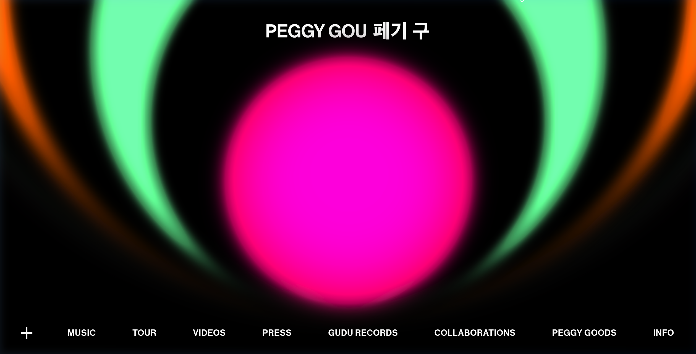 | 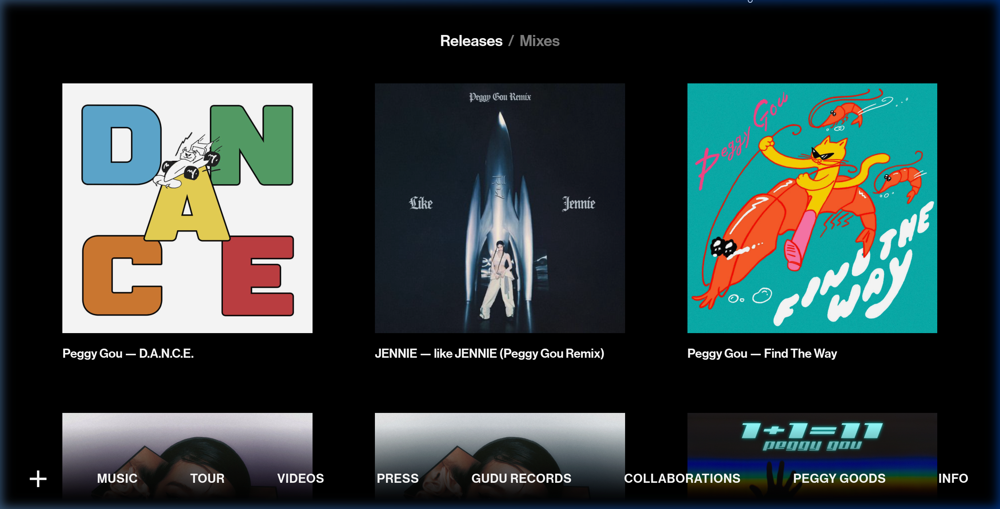 |

---

## 4. Estrutura Proposta para o Website

O site será estruturado em formato **Single-Page Application cinematográfica com navegação âncora rápida**, garantindo que não haja quebras de carregamento:

```
┌────────────────────────────────────────────────────────────────────────┐
│  [HUD HEADER]  PARU // CORE v2.0   [BPM: 128]   [AUDIO: ON/OFF]   MENU  │
├────────────────────────────────────────────────────────────────────────┤
│  01. HERO (System Initialize)                                          │
│      - Terminal Bootloader animado (> INICIANDO PROTOCOLOS...)         │
│      - Logo PARU com efeito 3D Glow e silhueta com pink rim light      │
│      - Tagline: "Arquitetura Sonora Para Mentes Conectadas"            │
│      - CTAs: [ PRÓXIMOS SHOWS ]  [ ÚLTIMO LANÇAMENTO ]                 │
├────────────────────────────────────────────────────────────────────────┤
│  02. AVATAR INTERATIVO (O Felino Brutalista)                           │
│      - Mascote geométrico reativo ao cursor                            │
│      - Pulso sonoro na linha de frequência (128 BPM)                   │
│      - Transição de poses (Prowl / Pounce / Rest)                      │
├────────────────────────────────────────────────────────────────────────┤
│  03. FREQUÊNCIAS SONORAS (Músicas & Releases)                          │
│      - Cyberdeck Player com pré-escuta de 30s                          │
│      - Grid de faixas com metadados (BPM, Tom, Gravadora)              │
│      - Links diretos: Spotify, Beatport, Apple Music, Soundcloud       │
├────────────────────────────────────────────────────────────────────────┤
│  04. SEQUÊNCIAS AO VIVO (Agenda de Shows)                              │
│      - Tabela de alto contraste: Data | Cidade | Local | Ingressos     │
│      - Integração com Bandsintown ou JSON dinâmico                     │
│      - CTA para Promotores: "Solicitar data / Booking"                 │
├────────────────────────────────────────────────────────────────────────┤
│  05. O ARQUITETO (Manifesto & EPK / Press Kit)                         │
│      - Bio oficial e manifesto do arquétipo                            │
│      - Galeria com vestuário techwear e fotos oficiais                 │
│      - Botão de Download direto: [ BAIXAR PRESS KIT COMPLETO (ZIP) ]   │
├────────────────────────────────────────────────────────────────────────┤
│  06. TERMINAL DE COMUNICAÇÃO (Get in Touch)                            │
│      - Formulário de proposta para clubs e festivais                   │
│      - Contatos oficiais em destaque:                                  │
│        • WhatsApp Direto (+55 11 94723-6278)                           │
│        • Email (paru@site.com)                                         │
│        • Instagram (@paruvegan)                                        │
├────────────────────────────────────────────────────────────────────────┤
│  [FOOTER]  Horário de SP (UTC-3) | Binary Grid | Todos os Direitos     │
└────────────────────────────────────────────────────────────────────────┘
```

---

## 5. Arquitetura Tecnológica Recomendada

Recomendamos desenvolver a aplicação utilizando:

1. **Framework Principal**: **Next.js 14/15 (App Router)** com TypeScript.
   - *Por que não Wix?* O Wix não permite a criação de shaders WebGL personalizados, animações de terminal customizadas e sincronia com a Web Audio API com a mesma fluidez.
   - O Next.js garante carregamento em milissegundos, SEO impecável para os lançamentos e facilidade de deploy com custo zero de infraestrutura via Vercel ou Cloudflare Pages.
2. **Estilização**:
   - **Vanilla CSS com CSS Custom Properties** para os tokens do Brandbook:
     ```css
     :root {
       --color-chassi: #1a1a1a;
       --color-terminal-green: #12fe07;
       --color-neon-pink: #ff2e88;
       --color-white: #f9f9f9;
       --color-black: #000000;
       --font-codec: 'Codec Pro', sans-serif;
       --font-terminal: 'Fira Code', monospace;
       --font-body: 'Inter', sans-serif;
     }
     ```
3. **Animações & Interatividade**:
   - **GSAP (GreenSock) + ScrollTrigger**: Para orquestração de transições cinematográficas e revelação de texto.
   - **Canvas 2D / Three.js**: Para renderizar o Mascote Felino e o espectrograma de áudio.
   - **Web Audio API**: Para os efeitos sonoros de interface e pré-escuta das músicas.
4. **Integrações de Terceiros**:
   - **Bandsintown / Seated**: Para sincronização automática da agenda de shows.
   - **WhatsApp Business API**: Link direto com mensagem pré-configurada para contratações.

---

## 6. Cronograma de Implementação Proposto

| Etapa | Foco de Trabalho | Prazo |
| :---: | :--- | :---: |
| **1** | **Setup da Arquitetura & Design System**: Configuração Next.js, importação de fontes, paleta e estrutura de navegação. | 2 a 3 dias |
| **2** | **Hero Cinematográfico & Mascote Interativo**: Animação de bootloader, silhueta com pink rim light e felino brutalista reativo. | 3 a 4 dias |
| **3** | **Player Cyberdeck & Catálogo de Músicas**: Visualizador de áudio, cards de lançamentos e integração com streaming. | 3 a 4 dias |
| **4** | **Agenda de Shows & Canal de Booking**: Tabela de shows funcional com links de ingressos e formulário/WhatsApp de contato. | 2 dias |
| **5** | **EPK & Otimização Mobile**: Download de Press Kit, testes de velocidade (Lighthouse 95+) e responsividade em smartphones. | 2 dias |

---

## 7. Próximos Passos & Perguntas para Alinhamento

Para iniciarmos o desenvolvimento da interface, gostaríamos de confirmar com você e com o PARU:

1. **Domínio e Hospedagem**: Ele já tem um domínio próprio comprado (ex: `parumusic.com`) ou prefere que façamos o deploy inicial em um link provisório da Vercel (ex: `paru-core.vercel.app`) para aprovação?
2. **Vídeo e Fotos**: PARU já tem fotos oficiais de alta resolução ou vídeos de apresentações recentes para colocarmos no Hero e na galeria?
3. **Agenda Atual**: Já existem datas confirmadas de shows para os próximos meses que devemos cadastrar de largada?
4. **Músicas para Pré-Escuta**: Quais são as 2 ou 3 faixas/teasers principais que ele quer destacar no player do site?
5. **Preferência do Mascote**: O felino interativo deve ser sutil e minimalista (focado no pulso e olhar) ou uma animação mais proeminente e lúdica como na referência de Peggy Gou?

---
*Documento preparado com base nos materiais oficiais de PARU e análise aprofundada dos benchmarks Martin Garrix, James Hype e Peggy Gou.*
